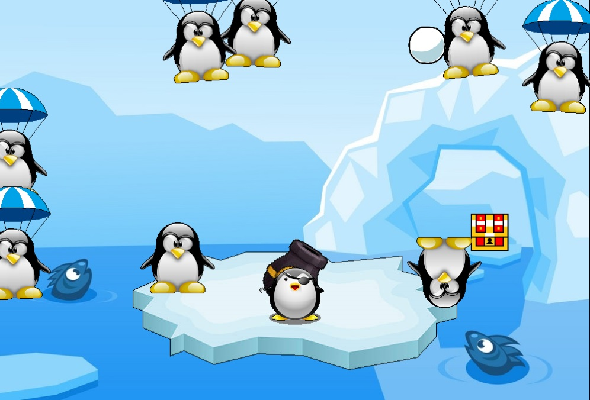

# Iceberg Invasion
Protect the pirate penguin's treasure from plundering paratroopers in this arcade shooter!



### Keyboard Controls
+ Left/Right arrows - aim cannon
+ Space - fire snowball (hold to fire repeatedly)
+ Enter - pause/unpause
+ Esc - quit

### Requirements
+ [Allegro 5.2](https://github.com/liballeg/allegro_wiki/wiki/Quickstart#installation) or later
+ C++ compiler (the shell script uses g++)

### Compile and run
#### Windows (MinGW) / Linux / macOS
Run the ```setup.sh``` shell script, passing your operating system's name as an argument:
```
./setup.sh [windows|linux|mac]
```
Then run the executable:
```
iceberg.exe
```
or
```
./iceberg
```
#### Windows (Visual Studio 2015+)
+ [Create a project and install Allegro.](https://github.com/liballeg/allegro_wiki/wiki/Allegro-in-Visual-Studio)
+ When [configuring Allegro](https://github.com/liballeg/allegro_wiki/wiki/Allegro-in-Visual-Studio#configuration), enable the Image, Truetype Font (TTF), Primitives, Dialog, and Font addons.
+ Build and run from within Visual Studio.

Reference: [Allegro wiki](https://github.com/liballeg/allegro_wiki/wiki/Quickstart)
